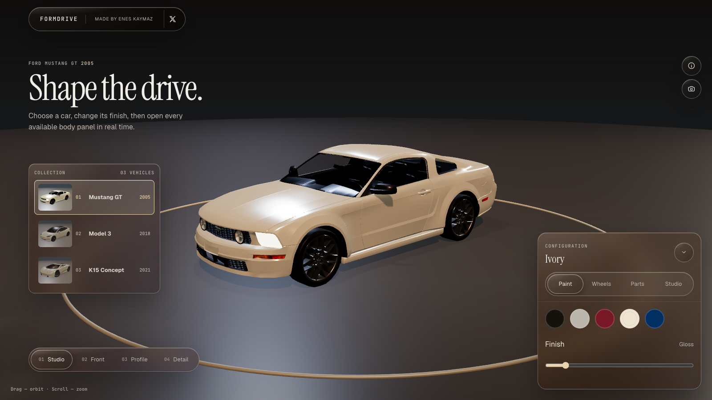
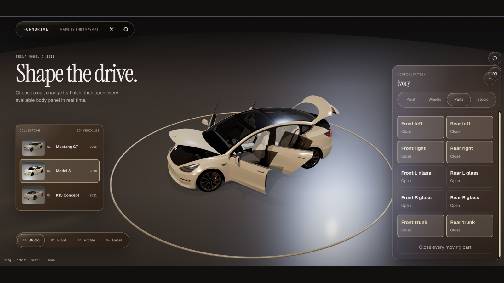

<div align="center">

# FormDrive

**A real-time 3D automotive studio for the web.**

[](https://react.dev/)
[](https://threejs.org/)
[](https://vite.dev/)
[](./LICENSE)
[](https://form-drive.vercel.app/)

Created by [Enes Kaymaz](https://github.com/nesdesignco) · [X](https://x.com/nesdesignco)

</div>

<p align="center">
  
  
</p>

## Overview

FormDrive is an open-source, component-based automotive configurator built around real PBR vehicle assets. It combines a restrained glass interface with a live Three.js scene, vehicle-specific moving parts, material configuration, studio lighting and deterministic camera views.

The application is designed as a working reference for production-oriented React Three Fiber architecture rather than a single-file 3D demo.

## Vehicle collection

| Vehicle | Year | Independent controls | Finish controls |
| --- | ---: | --- | --- |
| Ford Mustang GT | 2005 | Left/right doors, left/right windows, hood, trunk | Paint, gloss and wheels |
| Tesla Model 3 | 2018 | Four doors, four windows, front trunk, rear trunk | Paint, gloss and wheels |
| K15 Concept Coupé | 2021 | Left/right doors, left/right windows, hood, rear hatch | Paint, gloss and wheels |

All moving parts use model-specific pivots and definitions. Compound meshes—such as the Mustang's layered left window—are animated and masked as a single physical part.

## Highlights

- Real-time PBR rendering with WebGPU and automatic WebGL fallback
- React 19 and React Three Fiber component architecture
- Three independently configured vehicle assets
- Per-model door, glass, hood and trunk motion definitions
- Five paint finishes and three wheel treatments
- Dusk, Gallery and Noir lighting environments
- Projected headlights and emissive rear lighting
- Animated studio, front, profile and detail cameras
- Mouse/touch orbit controls with preset interruption
- PNG studio capture
- Responsive English interface with keyboard-visible focus states
- Cinematic first-visit loader with real asset-byte progress and cache-aware bypass
- Automated browser verification for every vehicle and moving part
- Staged vehicle loading that keeps the current car visible during downloads

## Loading architecture

FormDrive downloads only the Mustang model for the first scene. Selecting another car starts an isolated background load while the current car remains mounted and interactive. The selection commits only after the requested GLB is parsed successfully; a failed download never blanks the studio. Previously opened models remain in the in-memory glTF cache for instant return visits without being rendered off-screen.

On a visitor's first successful load, the opening sequence reports real transferred model bytes and advances visibly from 0 to 100 before revealing the studio. A persistent readiness marker bypasses the sequence on return visits so cached sessions open immediately.

| Model payload | Loading stage | File size |
| --- | --- | ---: |
| Mustang GT | Initial scene | 7.31 MiB |
| Model 3 | On selection | 21.62 MiB |
| K15 Concept | On selection | 11.23 MiB |

This policy is intentionally optimized for a three-car collection. A much larger catalog should add a bounded LRU cache and explicit Three.js resource disposal.

## Technology

| Layer | Technology |
| --- | --- |
| Application | React 19, React DOM |
| 3D composition | React Three Fiber, Drei |
| Renderer | Three.js WebGPU, WebGL fallback |
| State | Zustand |
| Build | Vite 7 |
| Assets | GLB/glTF, PBR materials |
| Verification | Chrome DevTools Protocol scripts |

## Getting started

### Requirements

- Node.js 22 or newer
- npm 10 or newer
- A current Chromium-based browser, Safari or Firefox

### Install and run

```bash
git clone https://github.com/nesdesignco/FormDrive.git
cd FormDrive
npm install
npm run dev -- --port 12314
```

### Production build

```bash
npm run build
npm run preview
```

The production output is written to `dist/`. Generated output, local browser captures and editor state are intentionally excluded from version control.

## Deployment

Every push to `main` is built and published by the included GitHub Pages workflow:

**[Open the live FormDrive studio](https://nesdesignco.github.io/FormDrive/)**

The production Vercel deployment is available at **[form-drive.vercel.app](https://form-drive.vercel.app/)**. Vercel can import the repository directly with the Vite preset, `npm run build` as the build command and `dist` as the output directory. Node.js is pinned to the 22.x release line for reproducible clean installs.

## Project structure

```text
FormDrive/
├── docs/                       # Repository media
├── public/models/              # Vehicle binaries, previews and attribution
├── scripts/                    # Browser and scene verification
├── src/
│   ├── components/scene/       # Renderer, models, cameras and lighting
│   ├── components/ui/          # Glass interface components
│   ├── config/                 # Vehicle and studio definitions
│   ├── state/                  # Zustand studio state
│   ├── App.jsx
│   └── style.css
├── tokens.css                  # Design tokens and glass material system
├── vite.config.js
└── package.json
```

## Verification

FormDrive includes deterministic verification scripts for scene state, UI layout and moving-part integrity.

Start the application on port `12314`, then launch Chrome with remote debugging on port `12319`:

```bash
open -na "Google Chrome" --args \
  --remote-debugging-port=12319 \
  --user-data-dir=/tmp/formdrive-chrome
```

Run the complete vehicle suites:

```bash
node scripts/verify-studio.mjs mustang 1536 900 --summary
node scripts/verify-studio.mjs tesla 1536 900 --summary
node scripts/verify-studio.mjs concept 1536 900 --summary
node scripts/verify-single-vehicle.mjs
```

The suites validate:

- Every paint, wheel and studio option
- Every door, window, hood and trunk control
- Compound window-mesh visibility
- Close-all behavior
- Camera presets and return to free orbit
- Headlight anchors, projected beams and light switching
- Ground contact and one-vehicle-only rendering
- Cold-start model requests and staged, non-blank vehicle switching
- Collection labels, preview assets and menu collisions
- Configuration panel motion and safe scrolling
- Responsive geometry at desktop, laptop, tablet and mobile viewports
- WebGPU renderer activation and console errors

## Model attribution

The application source is MIT licensed. Vehicle binaries and their preview renders are **not relicensed under MIT**; each remains subject to its original license.

| Asset | Creator/source | License |
| --- | --- | --- |
| 2005 Ford Mustang GT | [Ricy / Sketchfab](https://sketchfab.com/3d-models/2005-ford-mustang-gt-26b6b60cf2804370ac3c64424242dc1f) | [CC BY 4.0](./public/models/MUSTANG-LICENSE.md) |
| Tesla 2018 Model 3 | [Ameer Studio / Sketchfab](https://sketchfab.com/3d-models/tesla-2018-model-3-5ef9b845aaf44203b6d04e2c677e444f) | [CC BY 4.0](./public/models/TESLA-LICENSE.md) |
| Car Concept | Attribution distributed with the model | [CC BY 4.0](./public/models/CAR-CONCEPT-LICENSE.md) |

FormDrive is an independent technical and design study. It is not affiliated with, endorsed by or sponsored by Ford Motor Company, Tesla, Inc. or the respective model creators.

## Contributing

Bug reports and focused improvements are welcome. Read [CONTRIBUTING.md](./CONTRIBUTING.md) before opening a pull request. Changes affecting vehicle meshes, material matching or moving-part pivots must include verification results for all three vehicles.

## Security

Please report security concerns according to [SECURITY.md](./SECURITY.md). Do not publish sensitive vulnerability details in a public issue.

## License

Application source code is available under the [MIT License](./LICENSE). Third-party vehicle assets are governed by the attribution files stored beside them.
